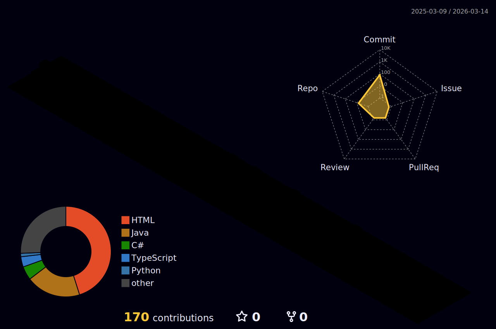

  

<!-- <h1 align="center">Olá! Eu sou o Arthur Damião 👋</h1> -->

- 👨‍💻 Estagiário de TI Full Stack
- 🌱 Atualmente estudando **Java, C# e Angular**
- 💼 Trabalhando com **PHP, PostgreSQL, CodeIgniter, JavaScript**
- 📚 Cursando Ciência da Computação
- 🚀 Interesses: Desenvolvimento Web, APIs, Banco de Dados, Machine Learning, Cloud e DevOps

### 🛠 Ferramentas e Tecnologias

- **Backend:**   
- **Frontend:**   
- **Database:** 
  

### Minhas Contribuições em 3D 🚀

  

  
  

### 📊 Estatísticas de Codificação (Semanais)

  
  

<!--
**damiao05/damiao05** is a ✨ _special_ ✨ repository because its `README.md` (this file) appears on your GitHub profile.

Here are some ideas to get you started:

- 🔭 I’m currently working on ...
- 🌱 I’m currently learning ...
- 👯 I’m looking to collaborate on ...
- 🤔 I’m looking for help with ...
- 💬 Ask me about ...
- 📫 How to reach me: ...
- 😄 Pronouns: ...
- ⚡ Fun fact: ...
-->
